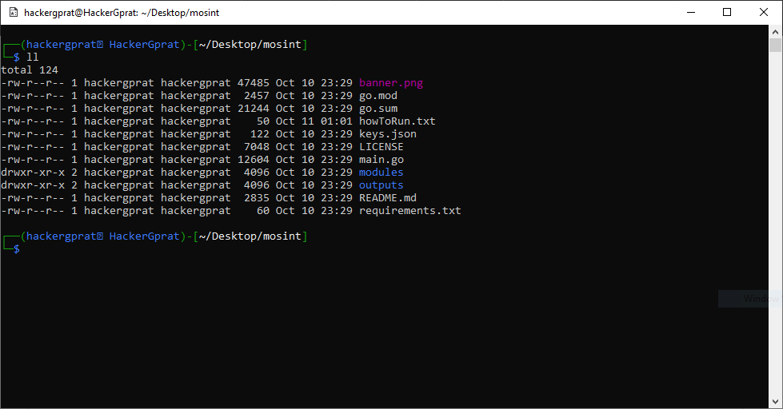
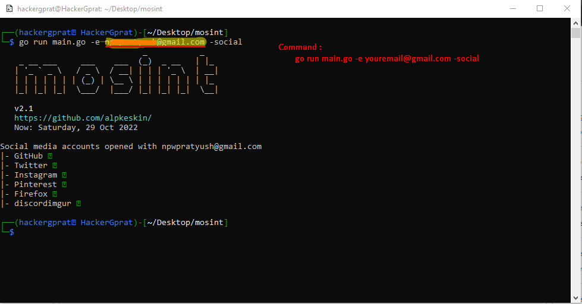

# Mosint > Doc > Social

I am Assuming That , You have sucessfully Installed the **Mosint**, if not than [click me](./installation.md)

Note : i did **Not Set ANY API KEY** , So it works Without API, Don't worry

## See My current  Mosint folder

## Run The Command
go run main.go -e yourmail@gmail.com -social

Now see the result