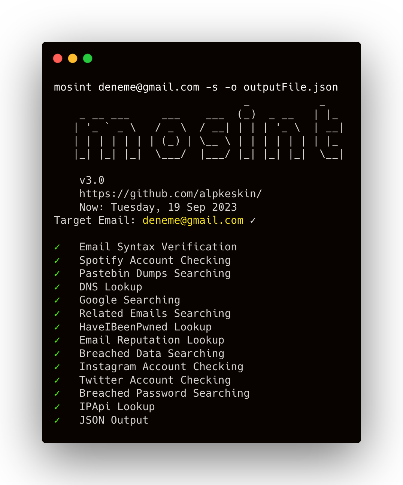

<h1 align="center">
  
  <br>
</h1>

<p align="center">
<a href="https://opensource.org/licenses/MIT"></a>
<a href="https://goreportcard.com/badge/github.com/alpkeskin/mosint"></a>
<a href="https://github.com/alpkeskin/mosint/releases"></a>
</p>

<p align="center">
  <a href="#features">Features</a> •
  <a href="#installation">Installation</a> •
  <a href="#services">Services</a> •
  <a href="#usage">Usage</a> •
  <a href="#docker">Docker</a> •
  <a href="#configuration-file">Config</a> •
  <a href="#screen">Screen</a>
</p>

Mosint is an automated email osint tool written in Go that allows you investigate for target emails in a fast and efficient manner. It consolidates numerous services, enabling security researchers to swiftly access a wealth of information.

# Features

<h1 align="center">
  
  <br>
</h1>

 - Fast and simple email-based scanning
 - Optimized for ease of use and **lightweight** on resources
 - Email verification and validation
 - Checking **Social Media** Accounts 
 - Checking **data breaches** and **password leaks**
 - Finding **related** emails and domains
 - Scanning **pastebin dumps**
 - Google Search
 - DNS/IP Lookup
 - Output to **JSON** file
 - Print coffee with `--coffee` flag!

# Installation

```sh
go install -v github.com/alpkeskin/mosint/v3/cmd/mosint@latest
```

# Services

| Service | Function | Status |
| :--- | :--- | :--- |
| [ipapi.co](https://ipapi.co/) - Public | More Information About Domain | :white\_check\_mark: |
| [hunter.io](https://hunter.io/) - Public | Related Emails | :white\_check\_mark: :key: |
| [emailrep.io](https://emailrep.io/) - Public | Breached Sites Names | :white\_check\_mark: :key: |
| [scylla.so](https://scylla.so/) - Public | Database Leaks | :construction: |
| [psbdmp.ws](https://psbdmp.ws/) - Public | Pastebin Dumps | :white\_check\_mark: :key: |
| [Intelligence X](https://intelx.io/)| Password Leaks | :white\_check\_mark: :key: |
| [BreachDirectory](https://breachdirectory.org/)| Password Leaks | :white\_check\_mark: :key: |
| [HaveIBeenPwned](https://haveibeenpwned.com/)| Password Leaks | :white\_check\_mark: :key: |

:key: API key required

# Configuration file

Mosint supports config file as default located at `$HOME/.mosint.yaml`. It allows you to define API keys for services.

**You must set the config file for mosint to run! To specify a configuration file located in a directory other than the home directory, you can use the `--config` flag.**

# Usage
```sh
mosint example@email.com
```
Call the help (`-h`) flag for more information on usage.

# Docker

Build a docker image
```sh
docker build -t mosint .  
```
Run the docker container using the image
```sh
docker run mosint --help
```

# Screen

[](https://asciinema.org/a/609038)

